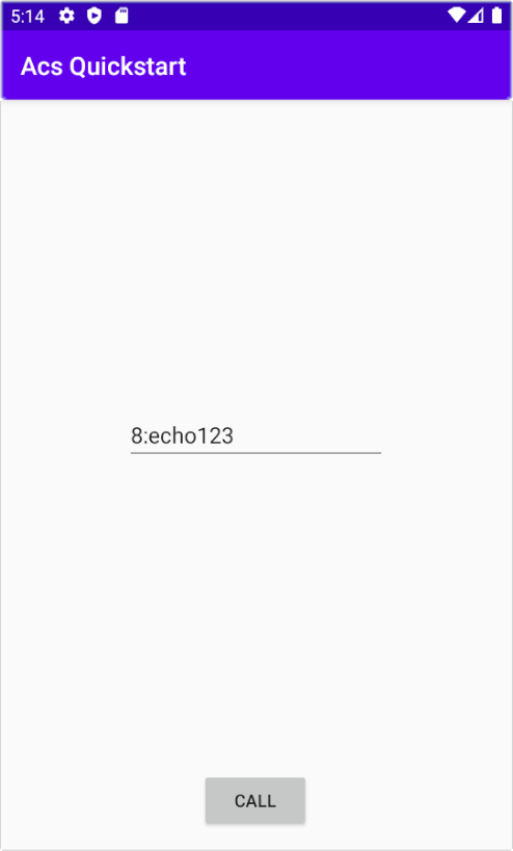

# Quickstart: Add voice calling to your Android app

For full instructions on how to build this code sample from scratch, look at [Quickstart: Add voice calling to your Android app](https://docs.microsoft.com/en-us/azure/communication-services/quickstarts/voice-video-calling/getting-started-with-calling?pivots=platform-android)

## Prerequisites

To complete this tutorial, you’ll need the following prerequisites:

- An Azure account with an active subscription. [Create an account for free](https://azure.microsoft.com/free/?WT.mc_id=A261C142F). 
- [Android Studio](https://developer.android.com/studio), for running your Android application.
- A deployed Communication Services resource. [Create a Communication Services resource](https://docs.microsoft.com/en-us/azure/communication-services/quickstarts/create-communication-resource).
- A [User Access Token](https://docs.microsoft.com/en-us/azure/communication-services/quickstarts/access-tokens?pivots=programming-language-csharp) for your Azure Communication Service.

## Code Structure

- **./app/src/main/java/com/contoso/acsquickstart/MainActivity.java:** Contains core logic for calling SDK integration.
- **./app/src/main/res/layout/activity_main.xml:** Contains core UI for sample app.

## Object model

The following classes and interfaces used in the quickstart handle some of the major features of the Azure Communication Services Calling client library:

| Name                                  | Description                                                  |
| ------------------------------------- | ------------------------------------------------------------ |
| CallClient| The CallClient is the main entry point to the Calling client library.|
| CallAgent | The CallAgent is used to start and manage calls. |
| CommunicationUserCredential | The CommunicationUserCredential is used as the token credential to instantiate the CallAgent.|

## Before running sample code

1. Open an instance of PowerShell, Windows Terminal, Command Prompt or equivalent and navigate to the directory that you'd like to clone the sample to.
2. `git clone https://github.com/Azure/Communication.git` 
3. With the `Access Token` procured in pre-requisites, add it to the **./app/src/main/java/com/contoso/acsquickstart/MainActivity.java** file. Assign your access token in line 27:
   ```private static final String UserToken = "<User_Access_Token>";```

## Run the sample

Open the sample project using Android Studio and run the application.



You can make an outbound VOIP call by providing a user ID in the text field and tapping the **Call** button. Calling `8:echo123` connects you with an echo bot, this is great for getting started and verifying your audio devices are working.
