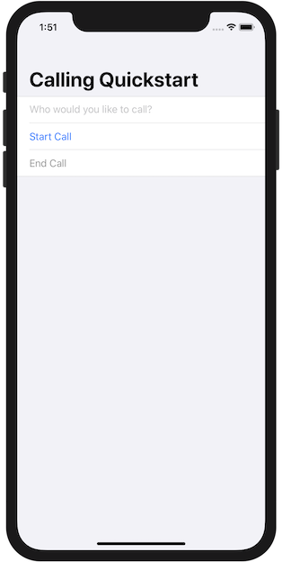

# Quickstart: Add voice calling to your iOS app

For full instructions on how to build this code sample from scratch, look at [Quickstart: Add voice calling to your iOS app](https://docs.microsoft.com/en-us/azure/communication-services/quickstarts/voice-video-calling/getting-started-with-calling?pivots=platform-ios)

## Prerequisites

To complete this tutorial, you’ll need the following prerequisites:

- An Azure account with an active subscription. [Create an account for free](https://azure.microsoft.com/free/?WT.mc_id=A261C142F). 
- A Mac running [Xcode](https://go.microsoft.com/fwLink/p/?LinkID=266532), along with a valid developer certificate installed into your Keychain.
- A deployed Communication Services resource. [Create a Communication Services resource](https://docs.microsoft.com/en-us/azure/communication-services/quickstarts/create-communication-resource).
- A [User Access Token](https://docs.microsoft.com/en-us/azure/communication-services/quickstarts/access-tokens?pivots=programming-language-csharp) for your Azure Communication Service.
- Run the shell script `BuildAzurePackages.sh` which is part of the release to build `AzureCommunication.framework` and `AzureCore.framework` packages and include the 2 packages in the sample

## Code Structure

- **./AzureCommunicationCallingSample/ContentView.swift:** Contains core UI and logic for calling SDK integration.
- **./AzureCommunicationCallingSample.xcodeproj:** Xcode project for the sample.

## Object model

The following classes and interfaces used in the quickstart handle some of the major features of the Azure Communication Services Calling client library:

| Name                                  | Description                                                  |
| ------------------------------------- | ------------------------------------------------------------ |
| ACSCallClient | The CallClient is the main entry point to the Calling client library.|
| ACSCallAgent | The CallAgent is used to start and manage calls. |
| CommunicationUserCredential | The CommunicationUserCredential is used as the token credential to instantiate the CallAgent.| 
| CommunicationIdentifier | The CommunicationIdentifier is used to represent the identity of the user which can be one of the following: CommunicationUser/PhoneNumber/CallingApplication. |

## Before running sample code

1. Open an instance of PowerShell, Windows Terminal, Command Prompt or equivalent and navigate to the directory that you'd like to clone the sample to.
2. `git clone https://github.com/Azure/Communication.git`
3. With the `Access Token` procured in pre-requisites, add it to the **AzureCommunicationCallingSample/ContentView.swift** file. Assign your access token in line 35:
   ```userCredential = try CommunicationUserCredential(token: "<USER_TOKEN_HERE>")```

## Run the sample

You can build an run your app on iOS simulator by selecting **Product** > **Run** or by using the (&#8984;-R) keyboard shortcut.



You can make an outbound VOIP call by providing a user ID in the text field and tapping the **Start Call** button. Calling `8:echo123` connects you with an echo bot, this is great for getting started and verifying your audio devices are working.
