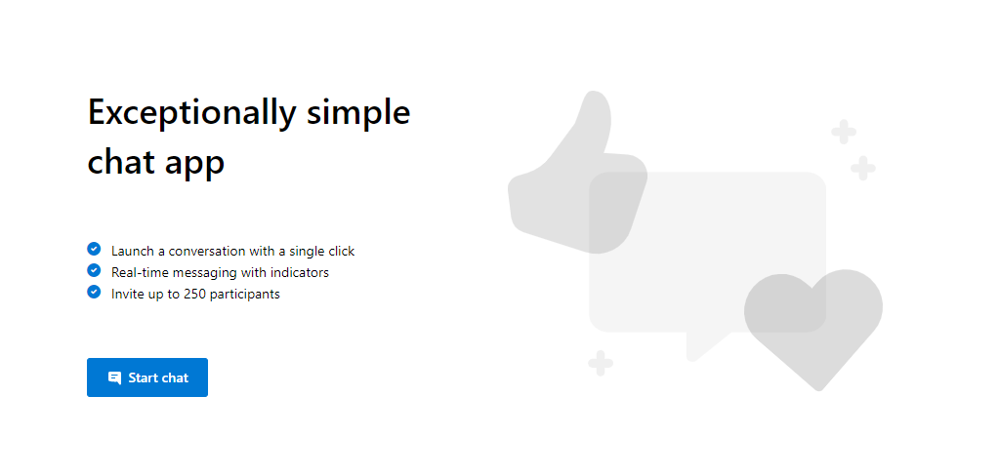

# Group Chat Sample

This is a sample application to show how the Chat Web SDK can be used to build a single threaded chat experience. 
The client-side application is a React based user interface which uses Redux for handling complex state while leveraging Microsoft Fluent UI. 
Powering this front-end is a C# web application powered by ASP.net Core to connect this application with Azure Communication Services.

Additional documentation for this sample can be found on [Microsoft Docs](https://docs.microsoft.com/azure/project-spool/samples/chat-hero-sample).

## Prerequisites

- Create an Azure account with an active subscription. For details, see [Create an account for free](https://azure.microsoft.com/free/?WT.mc_id=A261C142F).
- [Node.js (12.18.4 and above)](https://nodejs.org/en/download/)
- [Visual Studio (2017 and above)](https://visualstudio.microsoft.com/vs/)
- [.NET Core 3.1](https://dotnet.microsoft.com/download/dotnet-core/3.1) (Make sure to install version that corresponds with your visual studio instance, 32 vs 64 bit)
- Create an Azure Communication Services resource. For details, see [Create an Azure Communication Resource](https://docs.microsoft.com/en-us/azure/communication-services/quickstarts/create-communication-resource). You'll need to record your resource **connection string** for this quickstart.

## Code structure

- ./Chat/ClientApp: frontend client
  - ./Chat/ClientApp/src
    - ./Chat/ClientApp/src/Components : React components to help build the client app chat experience
    - ./Chat/ClientApp/src/Containers : Connects the redux functionality to the React components
    - ./Chat/ClientApp/src/Core : Containers a redux wrapper around the Chat SDK
    - ./Chat/ClientApp/src/index.js : Entry point for the client app
- ./Chat/Controllers : Server app core logic for client app to get a token to use with the ACS Web Chat SDK
- ./Chat/Program.cs : Server app program logic
- ./Chat/Startup.cs: Server app startup logic

## Before running the sample for the first time

1. Open an instance of PowerShell, Windows Terminal, Command Prompt or equivalent and navigate to the directory that you'd like to clone the sample to.
2. `git clone https://github.com/Azure/Communication.git`
3. Get the `Connection String` from the Azure portal. For more information on connection strings, see [Create an Azure Communication Resources](https://docs.microsoft.com/en-us/azure/communication-services/quickstarts/create-communication-resource)
4. Once you get the `Connection String`, Add the connection string to the **Chat/appsettings.json** file found under the Chat folder. Input your connection string in the variable: `ResourceConnectionString`.

## Local run

1. Go to the Chat folder and open the `Chat.csproj` solution in Visual Studio
2. Run the project. The browser will open at localhost:5000.

### Troubleshooting

1. Solution doesn\'t build, it throws errors during NPM installation/build

    Clean/rebuild the C# solution

## Publish to Azure

1. Right click the `Chat` project and select Publish
2. Create a new publish profile and select your app name, Azure subscription, resource group and etc.
3. Before publish, add your connection string with `Edit App Service Settings`, and fill in `ResourceConnectionString` as key and connection string (copy from appsettings.json) as value

## Additional Reading

- [Azure Communication Chat SDK](https://docs.microsoft.com/azure/project-spool/concepts/chat/sdk-features) - To learn more about the chat web sdk
- [Redux](https://redux.js.org/) - Client-side state management
- [FluentUI](https://developer.microsoft.com/en-us/fluentui#/) - Microsoft powered UI library
- [React](https://reactjs.org/) - Library for building user interfaces
- [ASP.net Core](https://docs.microsoft.com/en-us/aspnet/core/introduction-to-aspnet-core?view=aspnetcore-3.1) - Framework for building web applications
